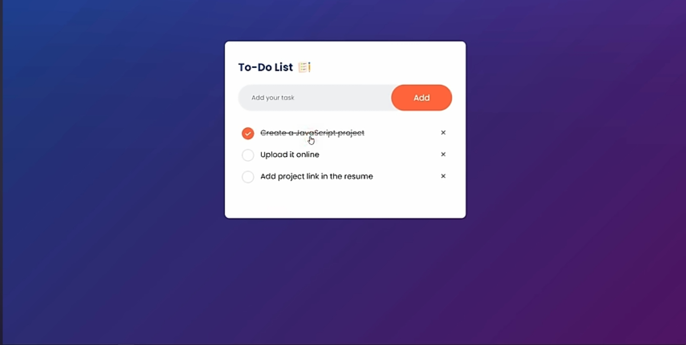

# To-Do List Application 📝

This is a simple and elegant To-Do List application built with HTML, CSS, and JavaScript. It allows users to add, mark as done, and delete tasks. The app provides a clean UI to track tasks with an option to check them off when completed and remove them if no longer needed.



## Features

- Add tasks to the list
- Mark tasks as completed with a checkbox
- Strike-through the text when tasks are completed
- Delete tasks from the list
- Responsive design

## How It Works

1. Enter a task in the input field and click the "Add" button.
2. Your task will appear in the list below with a checkbox and a delete button.
3. Mark the task as complete by clicking the checkbox, which will add a line-through to the task.
4. You can remove tasks by clicking the "X" button next to the task.

## Project Structure

```bash
├── index.html     # The main HTML file
├── style.css      # The main CSS file for styling
├── script.js      # JavaScript file to handle task addition, completion, and deletion
└── README.md      # This file, explaining the project
